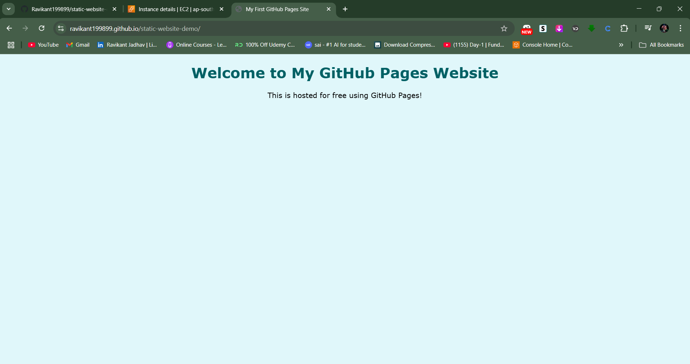

# 🌐 Static Website with GitHub Pages

A simple static website hosted for **free** using **GitHub Pages**.  
This project walks through creating a basic HTML site, pushing it to GitHub, enabling GitHub Pages, and customizing it with CSS.

---

## 🚀 Live Demo
🔗 [View Website](https://Ravikant199899.github.io/static-website-demo/)

---

## 📂 Project Structure
static-website-demo/
│── index.html
│── style.css
│── README.md
└── screenshots/


---

## 🛠 Technologies Used
- **HTML5** – Structure of the webpage
- **CSS3** – Styling and design
- **Git & GitHub** – Version control and hosting
- **GitHub Pages** – Free static site hosting

---

## 📖 Step-by-Step Guide

### **Step 1: Create Your Project Folder**
- Create a folder, e.g., `static-website-github-pages`
- Add `index.html` with your HTML content
- **Screenshot:**  


---

### **Step 2: Create a New GitHub Repository**
- Go to GitHub → Click **New Repository**
- Name it `static-website-demo` (public)
- Click **Create repository**
- **Screenshot:**  


---

### **Step 3: Push Your Website to GitHub**
```bash
git init
git add .
git commit -m "Initial commit"
git branch -M main
git remote add origin https://github.com/<your-username>/static-website-demo.git
git push -u origin main
```

Screenshot:


Step 4: Enable GitHub Pages
Go to Settings → Pages

Source: main/master branch → / (root)

Click Save

Screenshot:


Step 5: View Your Live Website
Open the provided GitHub Pages link in your browser

Screenshot:


Step 6: Customize with CSS
Create a style.css file

Link it in index.html:
<link rel="stylesheet" href="style.css">

Push changes to GitHub:
```
git add .
git commit -m "Added custom CSS"
git push
```


Before CSS:


After CSS:



👤 Author
Ravikant Jadhav
📧 Email: ravikantjadhav416@gmail.com

🔗 GitHub: @Ravikant199899

🔗 LinkedIn: www.linkedin.com/in/ravikant-jadhav-5a8351176
